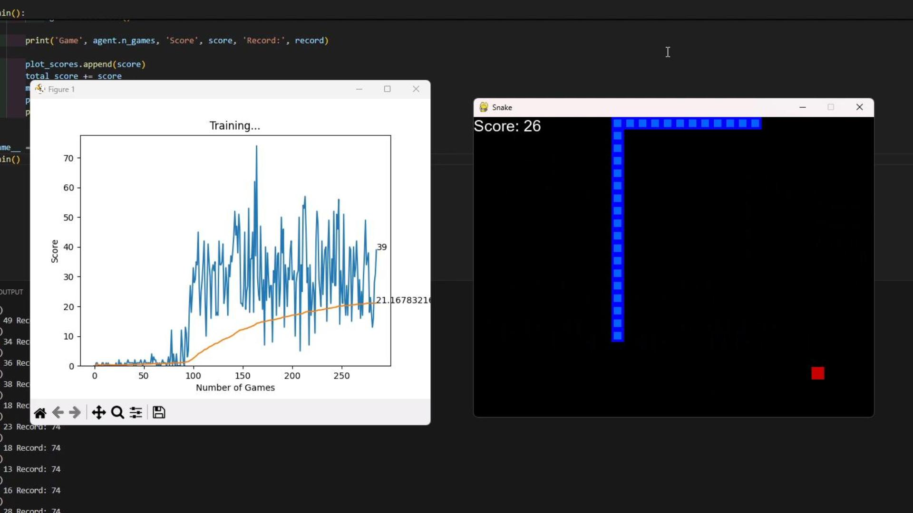

# Summary
This project applies reinforcement learning to teach an AI agent to play Snake. The agent uses a state-action-reward framework to navigate the grid, avoid collisions, and maximize score.

# Key features:
- State representation based on Snake’s position, direction, and proximity to food/walls
- Reward system encouraging food collection and penalizing collisions
- Training loop with performance tracking across episodes
- Visual interface to watch the AI play in real time

# Watch A Demo Video

